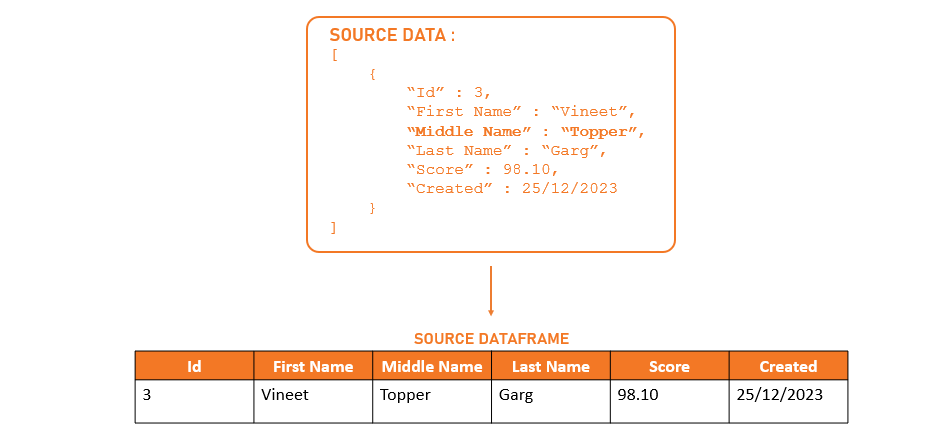
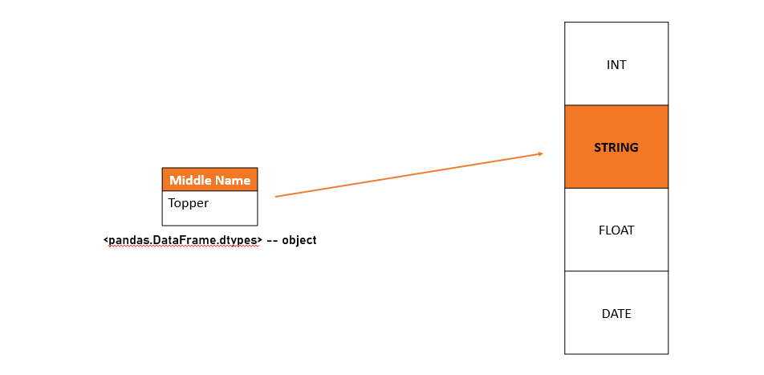
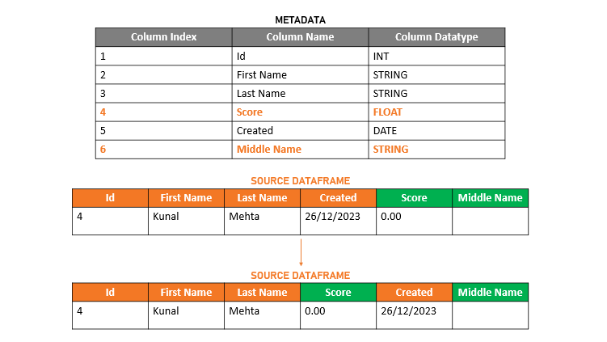

# Dynamic Metadata Management
Dynamic Metadata Management is a plug-in which will help its users dynamically add new columns(data points) coming from source to the target table. It will also help handle missing columns before saving data to destination. 

## Index
- [Overview](README.md#Overview)
  - [Pre-requisites](README.md#Pre-requisites)
  - [How it works](README.md#How-it-works)
- [Credits](README.md#Credits)

## Overview
### Pre-requisites
The plug-in will require metadata about your target table. The metadata should consist of -
  1. column name
  2. column data type
  3. index  (order/placement of columns in target table)
### How it works
The metadata helps give a good understanding about the existing structure of target table. The code will then use this information to- 
- detect new datapoints/columns from source and alter the table accordingly
- detect missing records and identify what type of null value to be filled based on column data type
#### Design
- Input : 
  ```
  - Source data converted to <pandas.DataFrame>
  - Pre-requisite metadata
  ```


- Output :
  ```
  - Modified pandas dataframe to be saved at destination as table
  ```

- Process :
  
  In an ETL process, the plugin will be placed inside the transform section. Once data has been extracted from source and converted to a <pandas.DataFrame>, it will be then fed into the plug-in along with target table metadata
    
  
  Addition of columns :
  
  When a new data point(s) has been fetched from source, the plug-in will compare the freshly fetched source columns with the existing metadata to detect a new column(s). It will then alter the target table structure to add the new columns. Finally, the plug-in returns the Dataframe to be sent to the Load(Save) part of the code where the dataframe can be appended to the target table.
  
  Eg:
  A school is storing entrance exam score details in their DB. The existing target table is as follows - 
      
  
  Their data pipeline fetches new data every data. The latest data (JSON Response) fetched by the extract function is given below -
  ```
  [
    {
        “Id” : 3,
        “First Name” : “Vineet”,
        “Middle Name” : “Topper”,
        “Last Name” : “Garg”,
        “Score” : 98.10,
        “Created” : 25/12/2023
    }
  ]
  ```
  
  We can notice that the above JSON has a new data point called **'Middle Name'**. The transform job converts the JSON to <pandas.DataFrame> and passes it as a parameter to the plug-in -
    
  
  Based on the content, the dataframe assigns **'object'** as the columns datatype. Using this info, the plug-in then identifies the corresponding DB appropriate datatype (like VARCHAR(65535) for POSTGRES), runs an alter statement - modifying the target table to add the new column.
    
    
  
  Finally, the Plug-in returns the dataframe after re-ordering columns in their correct order. And then the load job appends this data to the target table.
    
    
  
  *:warning: Note - please DO NOT FORGET to update target table metadata*
    
  
  
  Handling of Missing columns :
  If column(s) are missing from source dataframe, then the plug-in will identify those columns, retreive their datatypes from metadata and accordingly fill in the placeholder values before sending it to the load job.
  
  Eg: Continuing the above example, the latest data fetched now is of a student who failed to complete his exam on time and as a result didn't get a score. The JSON response fetched by the extract job is given below - 
  ```
  [
    {
        “Id” : 4,
        “First Name” : “Kunal”,
        “Last Name” : “Mehta”,
        “Created” : 26/12/2023
    }
  ]
  ```
  The current target table and source dataframe look like this - 
    
  
  The plug-in compares the columns from source dataframe and metadata to detect that **'Score'** and **'Middle Name'** are missing. So it retrieves its datatypes from metadata.  And based on the datatype it identifies what placeholder value needs to be filled for the respective columns in the dataframe.
    
    
  
  The plug-in then adds the columns with placeholder values, and re-orders them in accordance with the 'column_index' from metadata.
    
    
  Finally, the dataframe returned by plug-in is sent to load job to be appended to the target table.
    
  

2. Technologies Used
3. Challenges Faced and Features to be implemented in the future
  
## How to run the project
How to use the plugin

## Credits
> Krishna
>
> Kunal
>
> Saurav
>
> Vineet


## License (Optional)

## Badges (Optional)

## How to contibute (Optional)

## Tests
